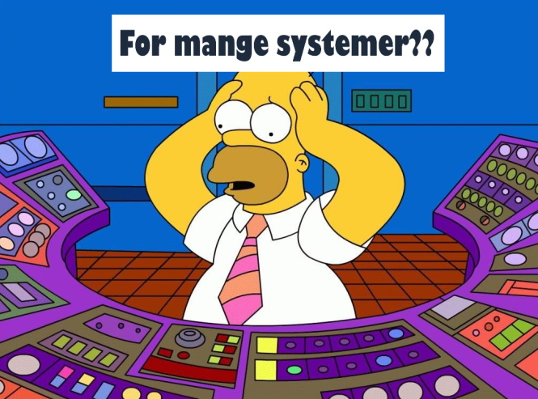

---
# Publishing mode
# draft = false means content is published. 
draft: false
# end

title: "Finn flyten!"

ingress: Har du jobbet i en passelig stor organisasjon i en passelig lang tid,
         så har du sikkert opplevd at ikke alt bestandig flyter like godt som det kanskje burde.
image: /flow.jpg
image_alt: "Elv med god flyt"

# Meta
date: 2022-02-16T15:52:58+01:00
readtime: 4 minutter
---

Fungerende og dedikerte DevOps-teams er på mange måter *privilegerte*.

Både verktøy, løsninger og metodikk som benyttes er med stor sannsynlighet laget
_nettopp_ for å understøtte flyt, automatisering og effektive, kontinuerlige leveranser.
Og alle på teamet er i tillegg enige om at disse tingene er viktige.

Men hvis man løfter blikket litt, utover kildekoden i neste [feature branch](https://trunkbaseddevelopment.com/),
så er det det nødvendigvis ikke slik i hele resten av organisasjonen.

Et DevOps-team som utvikler og drifter en løsning er som regel del av en større organisasjon (om man ikke er en liten startup),
og prosesser og verdistrømmer relevant for teamet involverer som regel også mange andre deler av organisasjonen.

## Flyt på tvers av systemer

Det er ikke uvanlig at organisasjoner allerede har diverse systemer på plass for å håndtere "saker", bestillinger og feedback av ulik natur.

Dette kan f.eks. være systemer for [help desk](https://en.wikipedia.org/wiki/Help_desk), [ITSM/ITIL](https://en.wikipedia.org/wiki/IT_service_management),
[kundeoppfølging](https://en.wikipedia.org/wiki/Customer_relationship_management), [håndtering av issues](https://en.wikipedia.org/wiki/Issue_tracking_system),
[chat](https://en.wikipedia.org/wiki/Online_chat), [roadmap](https://www.google.com/search?q=product+roadmap+software)
og [portefølje](https://en.wikipedia.org/wiki/IT_portfolio_management).

Det at saker må flyte på tvers av ulike systemer er gjerne lite effektivt (waste),
og om man kan konsolidere og forenkle disse prosessene og systemene så fører det til en bedre og mer effektiv flyt og dermed mer fornøyde kunder.

Utfordringen er at slik forenkling tar tid, og at fokus kanskje er på det enkelte system,
og ikke [verdistrømmene som går på tvers](https://en.wikipedia.org/wiki/Value-stream_mapping).

Et annet viktig poeng er *den røde tråden*.  
Ideelt sett så bør det være trivielt å følge saker på tvers av ulike prossesser, ansvarsområder og nivåer,
fra den minste user story opp til organisasjonens overordnede målsettinger.

## Flyt på tvers av teams

Å få en god flyt internt i ett team er en ting, det å få til god flyt på tvers av flere team og avdelinger er noe annet.

Et viktig steg er å sikre at alle har tilgang til kode og repos på tvers av organisasjonen, hvis ikke så blir det vanskelig å 
bidra eller fikse ting på tvers av teams, gi feedback og lære av hverandre, altså flyt av kompetanse.

Hvis noe kode ligger i GitLab, noe spredt på diverse områder på GitHub
og noe som private repos der kun noen få har tilgang, så blir det vanskelig å få til god flyt.

Noe så trivielt som å skrive et innlegg i en blogg kan føre til unødvendige spørsmål som *"hvor ligger egentlig repoet?"* og *"hvem kan gi meg tilgang?*"  
(helt tilfeldig eksempel 😇).

Eller enda verre, kanskje må du skrive innlegget som et Word-dokument og sende det til noen som så legger det inn i et system,
kanskje etter en del e-post fram og tilbake.

Poenget er at effektivt samarbeid og flyt på tvers av *én* organsiasjon krever gjennomsiktighet og åpenhet på tvers av organisasjonen.
Og naturlig nok, effektivt samarbeid på tvers av *flere* organisasjoner krever enda mer åpenhet.
